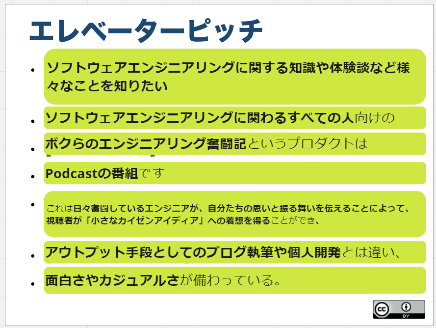
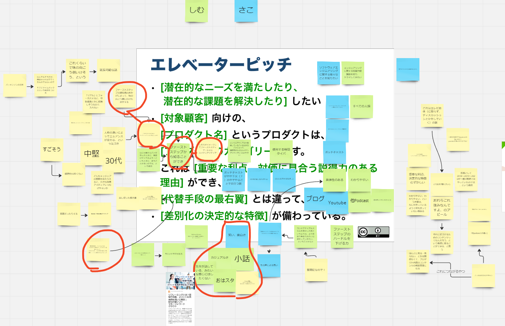

### episode. 1
<iframe src="https://podcasters.spotify.com/pod/show/572ili2aiig/embed/episodes/episode--1-e2l0td8/a-abc9649" height="102px" width="400px" frameborder="0" scrolling="no"></iframe>
BGM: MusMus  
配信開始日: 2024/06/18  
収録日: 2024/06/14

#### コンテンツ
1. オープニング
  1. 自己紹介など
2. 作成したエレベーターピッチの紹介
  1. なぜ作ったのか
  2. 作成したエレベーターピッチについて
     1.  
     2.  
  3. どうやってつくっていったか、つくっていく上で考えていたことはなにか
3. エンディング

### 参考リンク
- [ふりかえりガイドブック](https://www.shoeisha.co.jp/book/detail/9784798168791)
- [アジャイルサムライ](https://shop.ohmsha.co.jp/shopdetail/000000001901/)
- [インセプションデッキのテンプレート](https://github.com/agile-samurai-ja/support)
