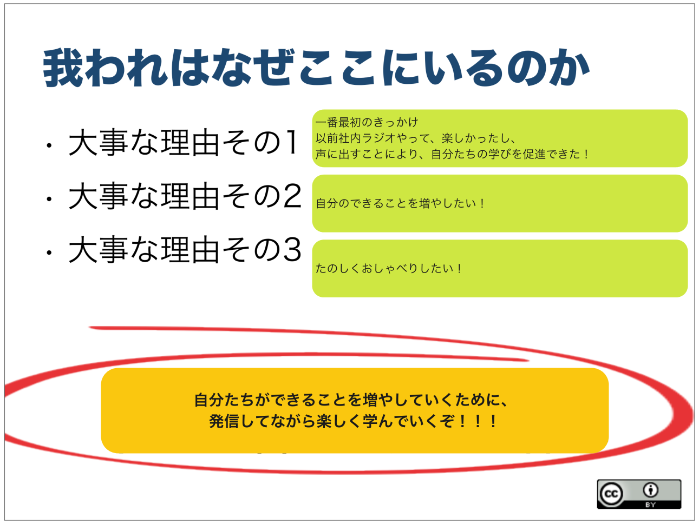
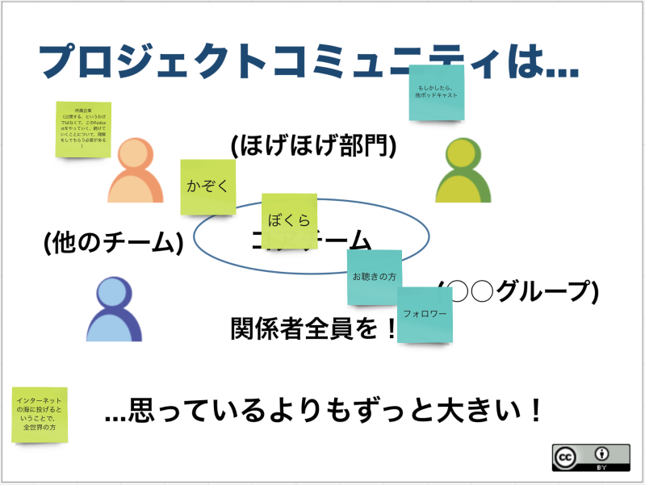
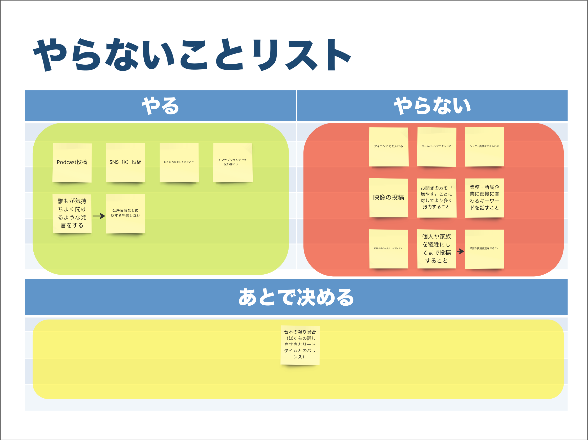

### episode. 2
<iframe src="" height="102px" width="400px" frameborder="0" scrolling="no"></iframe>
BGM: MusMus  
配信開始日: 2024/10/12  
収録日: 2024/10/07

#### コンテンツ
1. オープニング
2. 作成した「我われはなぜここにいるのか」の紹介
   1. どうやってつくっていったか
   2. 「Podcastやりたいプレゼン」をした話
3. 作成した「パッケージデザイン」の紹介
   1. どうやってつくっていったか
   2. もともとあった文章を変えたほうがよいのでは？ と考えた理由
4. 作成した「ご近所さんをさがせ」の紹介
   1. どうやってつくっていったか
5. 作成した「やらないことリスト」の紹介
   1. どうやってつくっていったか
   2. 肯定文で表現した方が良いよね
6. エンディング

### 完成系

### 参考リンク
- [アジャイルサムライ](https://shop.ohmsha.co.jp/shopdetail/000000001901/)
- [インセプションデッキのテンプレート](https://github.com/agile-samurai-ja/support)
- [インセプションデッキ - Agile Studio](https://www.agile-studio.jp/post/apm-inception-deck)
