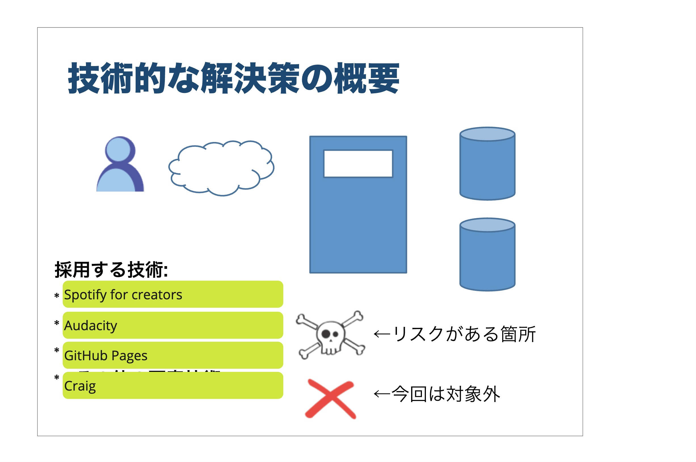
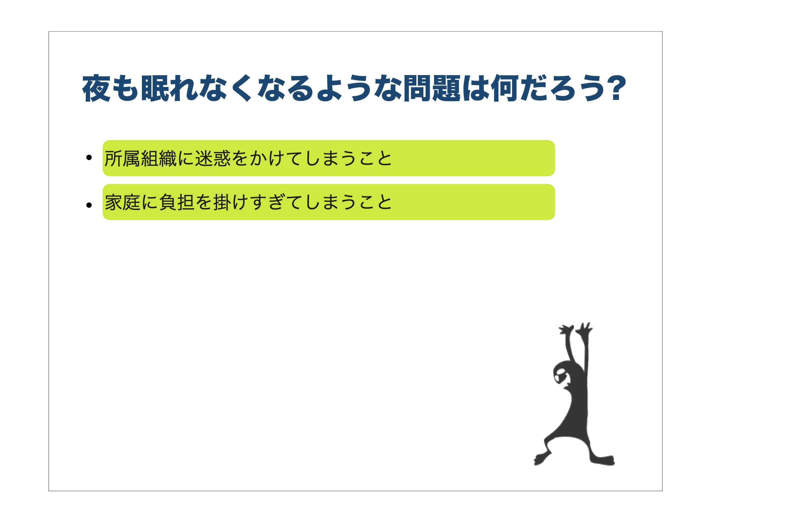
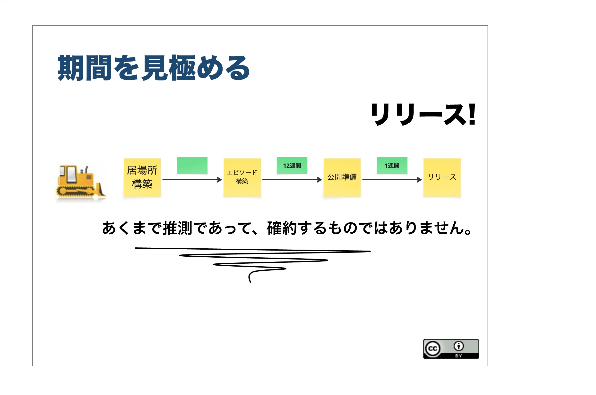
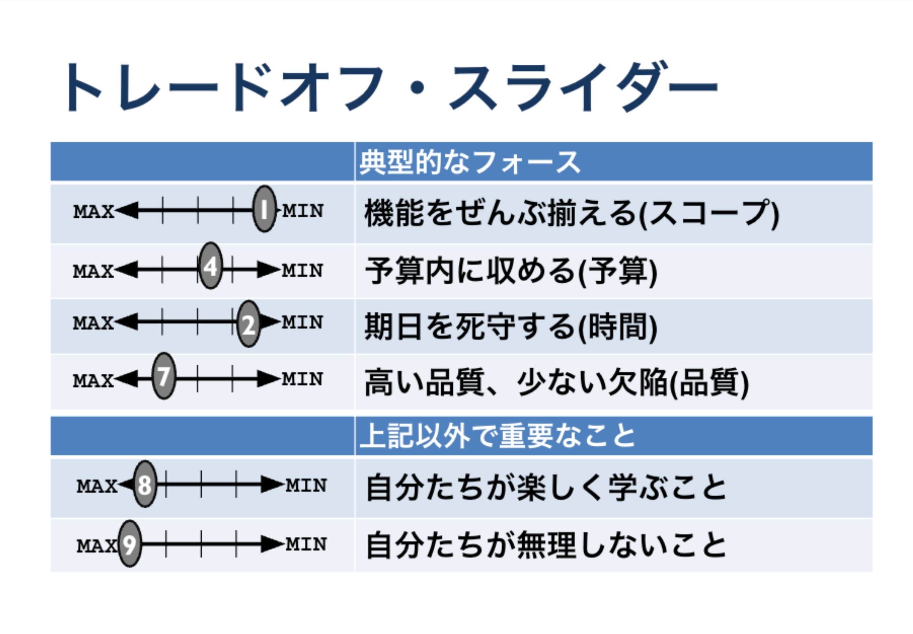
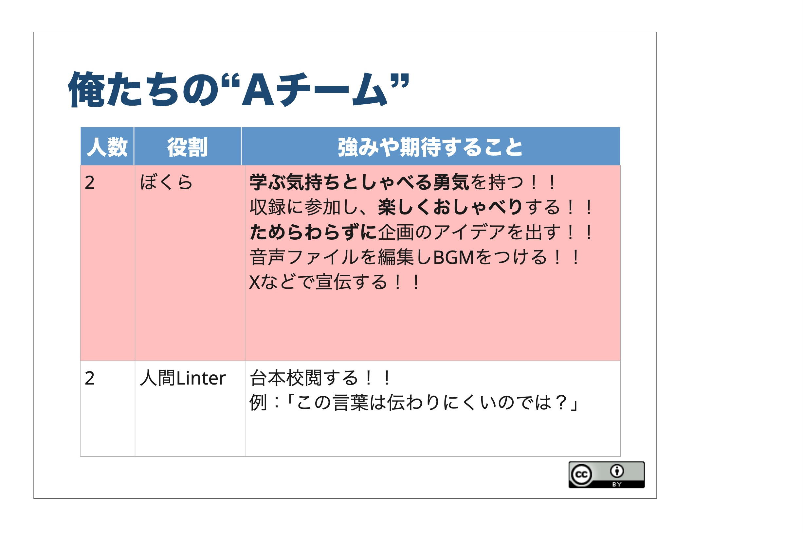
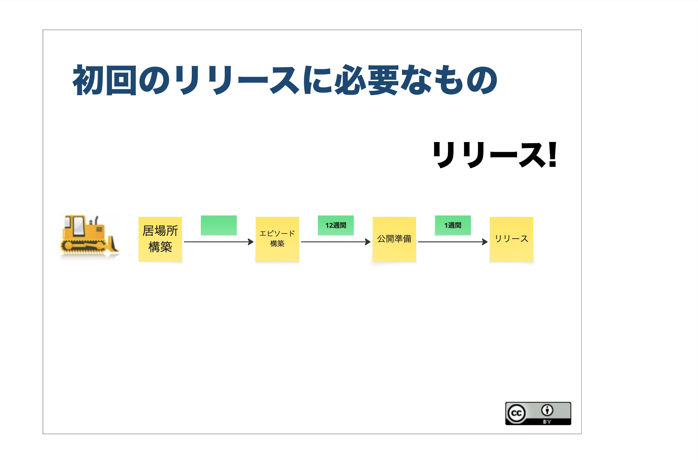

### episode. 3
<iframe src="TBD" height="102px" width="400px" frameborder="0" scrolling="no"></iframe>
BGM: MusMus  
配信開始日: 2025/05/24  
収録日: 2025/05/07

#### コンテンツ
1. オープニング
2. 作成した「解決策を描く」の紹介
   1. どうやってつくっていったか
   2. 「解決策を描く」の内容で作られている「ぼくえき」
3. 作成した「夜も眠れなくなるような問題」の紹介
   1. どうやってつくっていったか
   2. 無意識的に考えた点を深掘りした話
4. 作成した「期間を見極める」の紹介
   1. どうやってつくっていったか
5. 作成した「トレードオフ・スライダー」の紹介
   1. どうやってつくっていったか
   2. 四天王以外の「とらえどころのないもの」について
6. 作成した「俺たちのAチーム」の紹介
   1. どうやってつくっていったか
   2. 会社組織とのちがい
7. 作成した「初回のリリースに必要なもの」の紹介
   1. どうやってつくっていったか
8. エンディング

### 完成系

### 参考リンク
- [アジャイルサムライ](https://shop.ohmsha.co.jp/shopdetail/000000001901/)
- [インセプションデッキのテンプレート](https://github.com/agile-samurai-ja/support)
- [インセプションデッキ - Agile Studio](https://www.agile-studio.jp/post/apm-inception-deck)
