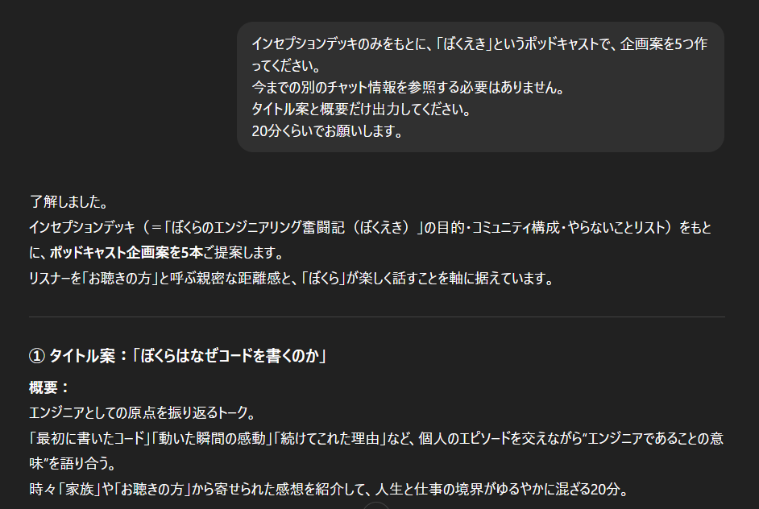
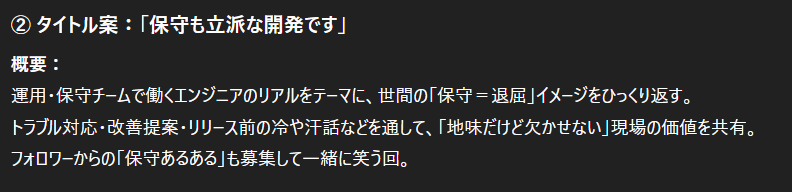
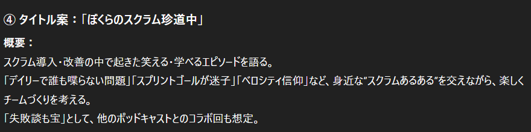
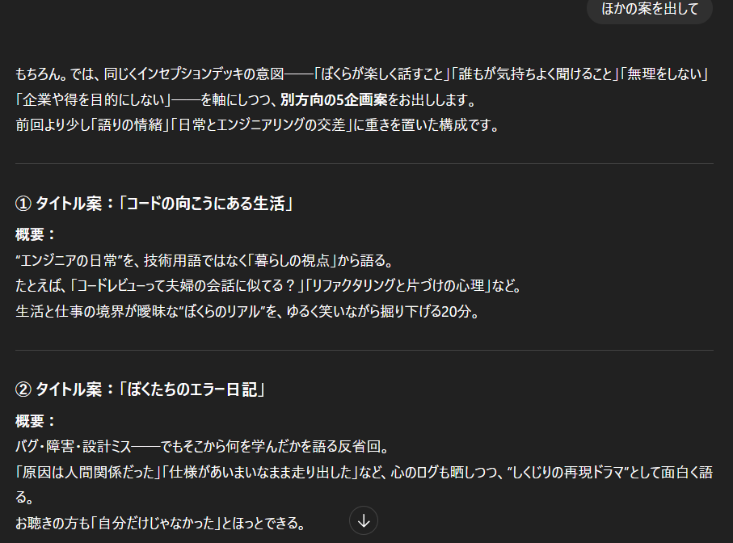
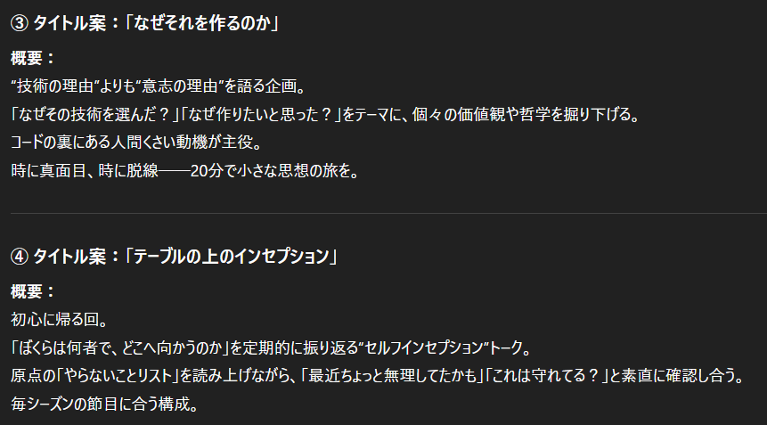
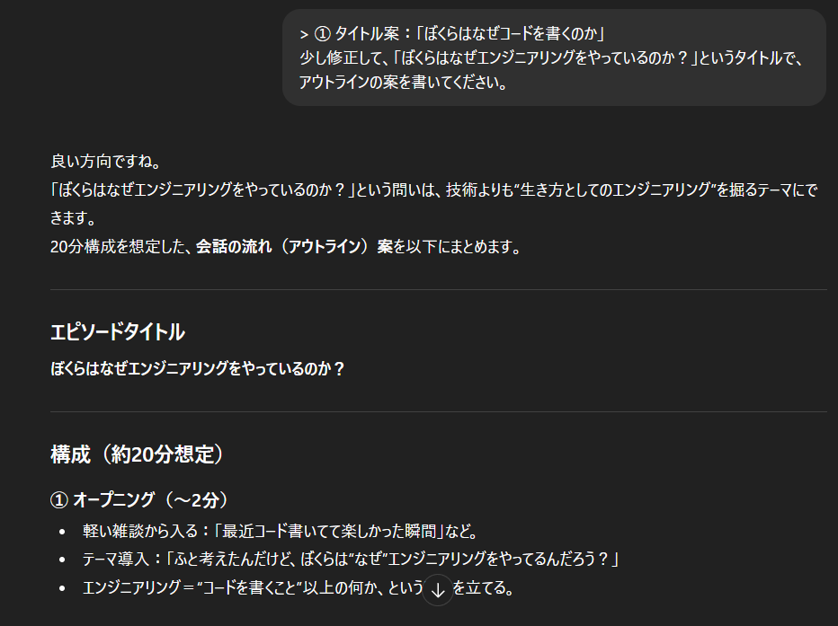
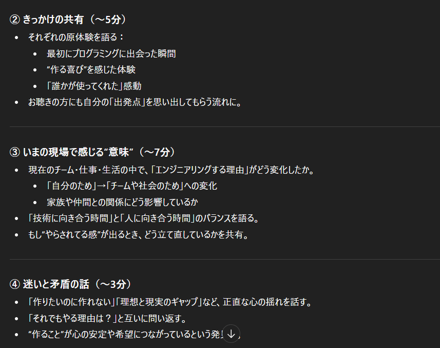
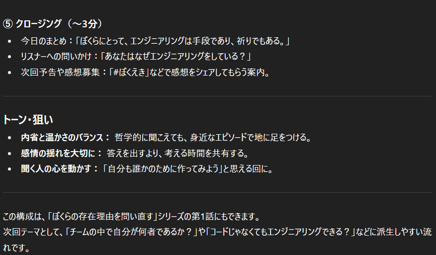

### episode. 6

<iframe src="https://creators.spotify.com/pod/profile/572ili2aiig/embed/episodes/episode-6---e3bu3nh/a-acbit79" height="102px" width="400px" frameborder="0" scrolling="no"></iframe>
BGM: MusMus  
配信開始日: 2025/12/05  
収録日: 2025/11/13

#### コンテンツ
1. オープニング
2. AIサービスにぼくらのインセプションデッキを学習してもらいました！
3. ぼくえきの企画を考えてもらおう！
4. ぼくえきのアウトラインも考えてもらおう！
5. エンディング

### 考えてもらった企画

### 追加で考えてもらった企画

### 考えてもらったアウトライン

